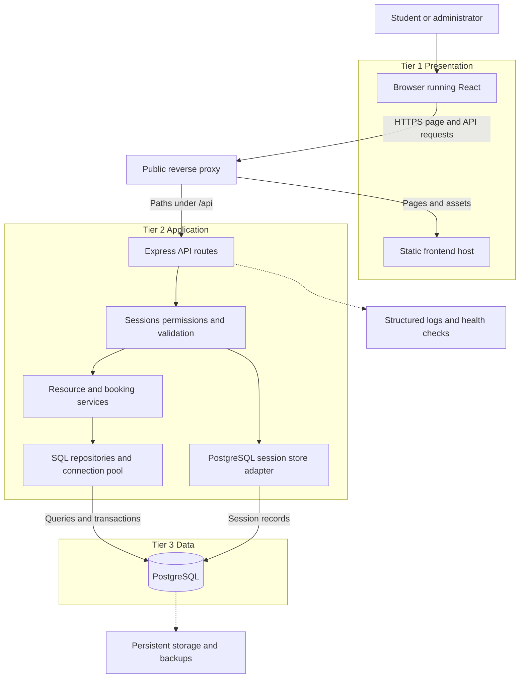

# Campus Resource Booking System

## Full stack implementation guide using AI

This guide defines a complete first version for a React workshop: a React frontend, an Express API and a PostgreSQL database. It includes prerequisites, architecture, business rules, a data model, API contracts, staged AI prompts, verification and deployment steps.

This deliverable is a build specification and instruction guide. It is not an implemented or tested application. Commands that depend on generated project files must be run after the relevant build stage. Suggested policies are teaching decisions that you may change before implementation.

## 1 The product and its boundaries

Students reserve an entire campus resource for a fixed one-hour slot. Examples are a study room, projector, laboratory workstation or badminton court. Administrators maintain resources, publish or close slots, inspect bookings and cancel a booking with a reason.

Each individually bookable item is a separate resource. Three projectors mean three resource records. A room's capacity describes how many people fit inside; it does not allow several independent bookings of the room in one slot.

The first version has two roles: STUDENT and ADMIN. Public registration always creates STUDENT accounts. Create the initial administrator through a controlled seed command, never through a role selector in a public form.

### Required features

| Module | Required behaviour |
|---|---|
| Accounts | Register, log in, log out, restore session on refresh and show the current user |
| Resource catalogue | Search, category/location filters, pagination and active resources |
| Resource details | Description, location, capacity, rules and date selection |
| Availability | Published slots with available, booked, closed and past states |
| Booking | Select a slot, enter a purpose, confirm and receive a booking reference |
| My bookings | Upcoming, past and cancelled views; permitted cancellation |
| Admin resources | Create, edit, deactivate and generate/close slots |
| Admin bookings | Filter bookings, inspect details, cancel with a reason and view event history |
| Usability | Responsive layout, labels, keyboard access, loading, empty and error states |
| Delivery | Migrations, fictional seed data, tests, logs, health endpoints and deployment instructions |

Screens: `/login`, `/register`, `/resources`, `/resources/:id`, `/my-bookings`, `/admin`. Use tabs inside the admin screen for resources, slots and bookings. Add a not-found page. Route guards improve navigation; backend permission checks provide the actual protection.

Defer email/SMS, payments, file uploads, QR check-in, recurring or multi-slot reservations, approval workflows, waitlists, SSO and a runtime model feature. These can be extensions after the core works. Public registration alone does not prove college membership; institutional verification or SSO is needed before treating the app as an official campus system.

### Booking policies for version one

- One campus timezone: Asia/Kolkata. Display it beside dates and times.
- Fixed slots: 09:00–10:00 through 16:00–17:00, identified by slot indexes 0–7.
- Students can book published slots from today through 13 days ahead, provided the slot has not started.
- The backend derives current time and slot times. It never accepts a client claim that a slot is in the future.
- Every booking reserves one resource and one slot. No arbitrary start/end times are accepted from the browser.
- Purpose is trimmed text of 10–300 characters. Render it as text, not HTML.
- Booking is confirmed immediately when all rules pass. There is no pending approval state.
- Students cancel only their own bookings before the slot starts. Admins may cancel a booking before it ends and must give a reason.
- Cancellation retains the record. Repeating an authorised cancellation returns the existing cancelled result without another cancellation event.
- Persisted booking statuses are CONFIRMED and CANCELLED. Upcoming, in-progress and past are calculated from status and slot times.
- Closing a slot or deactivating a resource with a confirmed booking that has not ended is rejected. An admin must cancel affected bookings first.
- Do not remove resources, slots or accounts in a way that destroys booking history.

## 2 Prerequisites

### What you need to know

Learn enough JavaScript to read functions, objects, arrays, imports, promises and async/await. Practise React components, props, state, events and effects. Understand JSON, HTTP methods/status codes, relational tables, primary/foreign keys and a basic SQL SELECT. Learn how to read browser Network/Console panels and backend logs.

You can learn these while building, but rehearse the finished workflow before teaching it. AI is useful for explanations and implementation; you remain responsible for checking its output.

### Tools and accounts

| Requirement | Purpose |
|---|---|
| VS Code or your preferred editor | Read and change project files |
| One AI coding assistant | Generate small changes, explain code and help debug |
| Node.js 24 LTS and npm | Run the build tools and API; verify support before installing |
| Git | Save working milestones and inspect changes |
| PostgreSQL 17 | Development and integration-test databases |
| Docker with Compose, optional | Run PostgreSQL without a native installation; package services later |
| Browser with developer tools | Inspect requests, cookies, responses and layout |
| SQL client, optional | Inspect records; psql or a graphical client is sufficient |
| Repository hosting account, optional locally | Share code and prepare CI/deployment |
| Hosting access, needed for deployment | Frontend/reverse proxy, API and private PostgreSQL |

An existing laptop capable of running your editor, browser, Node and PostgreSQL is enough. If memory is limited, run PostgreSQL natively or use a development database rather than adding unnecessary containers. Keep internet access available for package installation and your AI assistant.

Check tools:

```bash
node --version
npm --version
git --version
```

If using Docker:

```bash
docker --version
docker compose version
```

If using native PostgreSQL:

```bash
psql --version
```

Node 24 is listed as LTS at the time of preparation. Vite and other packages have their own runtime requirements; verify the installed versions, record the tested Node version and commit lockfiles. [Node releases](https://nodejs.org/en/about/previous-releases), [Vite setup](https://vite.dev/guide/).

### Chosen stack

| Concern | Choice and reason |
|---|---|
| Frontend | React with JavaScript and Vite; straightforward component teaching |
| Routing | React Router in declarative mode |
| Styling | Plain CSS; fewer configuration dependencies |
| Browser requests | fetch through one API helper |
| Backend | Node.js with Express 5 and JavaScript ES modules |
| Database access | pg with parameterised SQL; queries remain visible to students |
| Schema changes | node-pg-migrate and versioned migrations |
| Authentication | Server-side sessions in PostgreSQL, using express-session and connect-pg-simple |
| Passwords | Argon2id hashing using a maintained library |
| Validation | Zod or an equivalent maintained schema validator |
| Checks | Vitest and Supertest; browser tests for main journeys |
| Delivery | Static frontend server/reverse proxy, separate API service and private PostgreSQL |

No model API account or key is required to build the app using an AI coding assistant. The app itself has no runtime model dependency in version one.

## 3 Architecture

The diagram shows the proposed deployed system. Replies travel back along the request path. The reverse proxy supplies one public origin while the frontend, API and database remain separately deployable services.



The SQL repositories and session adapter are modules inside the API service, not extra microservices. Logs and backups are supporting facilities, not additional application tiers.

| Environment | Browser address | API route | Database access |
|---|---|---|---|
| Local | localhost:5173 | Vite proxies `/api` to localhost:4000 | API connects to PostgreSQL on localhost:5432 |
| Deployment | One HTTPS application origin | Reverse proxy forwards `/api` to the API service | API connects over a private network or provider-approved restricted connection |

Use relative `/api` URLs in React. The local Vite proxy and deployed reverse proxy keep browser requests on the same origin. A different-origin deployment needs a deliberate cookie/CORS design; do not add wildcard CORS to make errors disappear. [Vite proxy configuration](https://vite.dev/config/server-options).

Only the API receives database credentials and session secrets. A browser user must never receive the database URL. The database port is not public in the deployed design. Local containers demonstrate the tier boundaries; separate hosting demonstrates independent deployment.

## 4 Database design

| Table | Important fields and rules |
|---|---|
| users | id, name, normalised email with unique constraint, password_hash, role, created_at |
| resources | id, name, category, description, location, positive capacity, rules, is_active, created_at |
| resource_slots | id, resource_id, booking_date, slot_index, is_open; unique resource/date/index; index restricted to 0–7 |
| bookings | id, user_id, slot_id, purpose, status, created_at, cancelled_at, cancelled_by, cancellation_reason |
| booking_events | id, booking_id, actor_user_id, event_type, occurred_at, details |
| sessions | Session store table with session ID, serialised session and expiry; use the store library's documented schema |

Use UUID primary keys for application records. Foreign keys connect slots to resources, bookings to slots and users, and events to bookings and actors. Use non-null and CHECK constraints for required fields and allowed values. Add indexes for user booking history and resource/date availability.

The session table is infrastructure data: do not expose it through an application endpoint. Create it through a migration that matches the installed session-store library; avoid silently creating production tables at runtime.

### Why date and slot index

The slot representation makes every bookable interval canonical. Index 0 is 09:00–10:00 IST; index 7 is 16:00–17:00 IST. Two different IDs cannot represent the same resource/date/index because of the compound uniqueness constraint. Users cannot invent partly overlapping intervals.

Keep the calendar date as a PostgreSQL DATE, and return it as a YYYY-MM-DD string. Derive absolute timestamps centrally. For example:

```sql
SELECT
  (booking_date + TIME '09:00' + slot_index * INTERVAL '1 hour')
    AT TIME ZONE 'Asia/Kolkata' AS starts_at,
  (booking_date + TIME '09:00' + (slot_index + 1) * INTERVAL '1 hour')
    AT TIME ZONE 'Asia/Kolkata' AS ends_at
FROM resource_slots;
```

Return startsAt/endsAt as ISO timestamps with an offset or Z. Format them in Asia/Kolkata in the UI. Avoid converting a calendar-date filter through the browser's local timezone. Keep creation, cancellation and event timestamps as TIMESTAMPTZ.

### The essential conflict constraint

```sql
CREATE UNIQUE INDEX one_confirmed_booking_per_slot
ON bookings (slot_id)
WHERE status = 'CONFIRMED';
```

This permits historical cancelled bookings while enforcing a maximum of one confirmed booking per slot. A plain unique constraint on slot_id would prevent booking a slot again after cancellation. PostgreSQL supports partial unique indexes for this purpose. [PostgreSQL partial indexes](https://www.postgresql.org/docs/current/indexes-partial.html).

### Safe booking transaction

1. Authenticate the user and validate the request before entering the business operation.
2. Borrow one client from the connection pool and begin a transaction.
3. Lock the resource row, then its slot row, in that order. Revalidate the active/open flags and slot start time under those locks.
4. Insert a CONFIRMED booking using the user ID from the session.
5. Insert its CREATED event within the same transaction.
6. Commit and return HTTP 201.
7. If the named booking uniqueness rule is violated, roll back and return HTTP 409 with `SLOT_ALREADY_BOOKED`. Do not map every SQL error to a booking conflict.
8. On any other failure, roll back, log a safe diagnostic and return an appropriate error. Release the database client in a finally block.

All statements in a transaction must use the same borrowed client, not separate pool.query calls. [node-postgres transactions](https://node-postgres.com/features/transactions).

Use the same resource-then-slot-then-booking lock order for related cancellation/closure operations. Deactivation locks the resource before checking outstanding bookings. These short locks serialize changes to a resource in this small teaching app; the uniqueness index remains the final double-booking defence. Do not keep a transaction open while waiting for user input or a third-party API.

Availability shown in React is a snapshot. It can change before confirmation; always enforce booking rules again in the backend and database.

## 5 API contract

Define and document this contract before generating the frontend. All protected endpoints authenticate the session on the server. List endpoints validate pagination and return bounded results.

| Method and route | Access | Purpose |
|---|---|---|
| GET /api/health/live | Public | Process liveness; no sensitive configuration |
| GET /api/health/ready | Public | Database readiness; 503 on failure without database details |
| GET /api/auth/csrf | Public with session | Obtain the session-bound CSRF token |
| POST /api/auth/register | Public with CSRF | Create a STUDENT account; then require login |
| POST /api/auth/login | Public with CSRF | Verify credentials, rotate session ID and establish login |
| GET /api/auth/me | Signed in | Return safe current-user fields |
| POST /api/auth/logout | Signed in with CSRF | Destroy session and clear cookie |
| GET /api/resources | Signed in | Search/filter active resources |
| GET /api/resources/:id | Signed in | Read one active resource |
| GET /api/resources/:id/slots?date=YYYY-MM-DD | Signed in | Availability with canonical start/end timestamps |
| POST /api/bookings | Signed in with CSRF | Book a slot using `{ slotId, purpose }` |
| GET /api/bookings/mine | Signed in | Only current user's booking history |
| POST /api/bookings/:id/cancel | Owner or admin with CSRF | Cancel under the defined policy |
| GET /api/admin/resources | Admin | Include inactive resources |
| POST /api/admin/resources | Admin with CSRF | Create a resource |
| PATCH /api/admin/resources/:id | Admin with CSRF | Edit or deactivate under the defined policy |
| POST /api/admin/resources/:id/slots/generate | Admin with CSRF | Idempotently publish canonical slots in an allowed date range |
| PATCH /api/admin/slots/:id | Admin with CSRF | Set isOpen; reject closure with an outstanding confirmed booking |
| GET /api/admin/bookings | Admin | Filter all bookings |
| GET /api/admin/bookings/:id/events | Admin | Read booking event history |

Slot generation accepts a validated fromDate/toDate within the booking window and constructs indexes 0–7 itself. It does not accept arbitrary times. Existing slots remain unchanged, including closed slots. Changing a slot to open is a separate explicit admin action.

Example success response:

```json
{
  "data": {
    "id": "booking-uuid",
    "status": "CONFIRMED",
    "slotId": "slot-uuid"
  }
}
```

Example error response:

```json
{
  "error": {
    "code": "SLOT_ALREADY_BOOKED",
    "message": "This slot was just booked. Please choose another slot."
  },
  "requestId": "request-id"
}
```

Use 400 for malformed/invalid input, 401 for no valid login, 403 for permission/CSRF failure, 404 for a missing resource, 409 for a state conflict and 429 for a rate limit. Do not send stack traces, SQL strings containing sensitive data or password hashes to the browser.

## 6 Authentication and application protection

Use server-side session authentication for this browser application. Store session data in PostgreSQL and send only the session identifier in an HttpOnly cookie. Do not store a bearer token in localStorage as a shortcut.

Set SameSite=Lax, a finite expiry and Secure in HTTPS deployments. Keep the cookie host-only. Regenerate the session ID after successful login, rotate the CSRF token with it, and destroy the session on logout. Use an explicit cookie name and matching options when clearing it. Reload the current user's role from trusted server data instead of trusting a role submitted by the browser.

Use a synchronizer CSRF token bound to the session, sent through a custom header on state-changing requests. Require it for register/login as well as authenticated writes, and validate the allowed Origin on browser mutations. Refresh the frontend token after login rotates the session. SameSite is an additional defence, not your only CSRF mechanism.

Hash passwords with Argon2id using current library guidance. Rate-limit authentication attempts, cap request-body sizes, validate inputs and use parameterised SQL. Keep session cookies, passwords, tokens and sensitive fields out of logs. Use a PostgreSQL session store rather than Express's default MemoryStore. Sources: [Express sessions](https://expressjs.com/en/resources/middleware/session.html), [OWASP sessions](https://cheatsheetseries.owasp.org/cheatsheets/Session_Management_Cheat_Sheet.html), [OWASP CSRF](https://cheatsheetseries.owasp.org/cheatsheets/Cross-Site_Request_Forgery_Prevention_Cheat_Sheet.html), [OWASP password storage](https://cheatsheetseries.owasp.org/cheatsheets/Password_Storage_Cheat_Sheet.html), [parameterised queries](https://node-postgres.com/features/queries).

Use one backend instance for the workshop. If deploying multiple instances later, use a shared rate-limit store or gateway control rather than assuming an in-memory rate limit is global. Configure trust proxy only for the known deployment topology; blindly trusting forwarded headers is not a fix for cookie or logging issues.

## 7 Repository layout

| Path | Responsibility |
|---|---|
| client/src/pages | Route-level screens |
| client/src/components | ResourceCard, SlotPicker, BookingForm, StatusMessage and navigation |
| client/src/api | fetch wrapper, response parsing and CSRF handling |
| client/src/context | Current user and session state |
| client/src/styles | Layout, forms and responsive styles |
| server/src/routes | URL definitions and middleware attachment |
| server/src/controllers | Translate HTTP requests and responses |
| server/src/services | Booking and resource business rules |
| server/src/repositories | Parameterised SQL and transaction-aware operations |
| server/src/middleware | Authentication, permissions, validation, CSRF and errors |
| server/src/db | Pool and database configuration |
| server/migrations | Versioned schema, index and session-table changes |
| server/scripts | Seed and setup scripts |
| server/tests | Isolated database integration tests |
| docs | Brief, schema, API contract, checks and architecture |
| infra | Compose, reverse-proxy and deployment configuration |

Avoid adding controllers/services/repositories that merely pass values around without a purpose. The split should help students locate HTTP handling, business rules and SQL.

## 8 Step by step build process

Complete each gate before proceeding. Ask AI to explain the actual files it changed, inspect the diff and commit a working milestone.

### Step 1 Save a precise brief

Create docs/brief.md with the scope and policies in this guide; docs/schema.md with the table design; docs/api-contract.md with the endpoints; docs/acceptance-checks.md with the checks below. These are the context files you will give the assistant.

Ask for a plan before code using Prompt A. Gate: the proposed implementation matches fixed slots, sessions, role permissions and database conflict protection.

### Step 2 Scaffold the repository

Run from a new working directory:

```bash
mkdir campus-resource-booking
cd campus-resource-booking
git init
npm create vite@latest client -- --template react
cd client
npm install
npm install --save-exact react-router
cd ..
mkdir server
cd server
npm init -y
npm install --save-exact express@5 pg express-session connect-pg-simple argon2 zod helmet express-rate-limit dotenv pino pino-http
npm install --save-dev --save-exact nodemon node-pg-migrate vitest supertest
cd ..
```

Latest scaffolding is for the initial preparation only. After successful setup, preserve both package-lock.json files and record the tested Node version. Subsequent installs use npm ci in each package directory. Check package engines and resolve incompatibilities deliberately; do not use force flags to ignore them.

Ask AI to create the server entry point, scripts, error handler, environment validation and documentation directories using Prompt B. Have it add backend linting using an appropriate compatible configuration. Gate: the frontend starts and the API liveness endpoint responds.

### Step 3 Prepare PostgreSQL and environment configuration

Choose native PostgreSQL or a Compose database; you do not need both. Create separate databases for development and tests. With Docker, bind the local database only to 127.0.0.1, use a named volume and configure a database health check. Use a supported pinned major such as PostgreSQL 17 and record the exact tested image before distributing the workshop.

Have AI produce the Compose/setup instructions and secure local role-creation instructions. Use a non-superuser application account. A migration account can own the schema; the runtime account should receive only the privileges required for normal operations.

| Server environment variable | Meaning |
|---|---|
| PORT | 4000 locally |
| NODE_ENV | development locally; production when deployed |
| DATABASE_URL | Runtime database connection; server-only secret |
| MIGRATION_DATABASE_URL | Migration account connection, available to migration jobs only |
| TEST_DATABASE_URL | Isolated integration-test database |
| SESSION_SECRET | Long random value; server-only secret |
| APP_ORIGIN | http://localhost:5173 locally; exact HTTPS origin when deployed |
| SEED_ADMIN_EMAIL and SEED_ADMIN_PASSWORD | Local seed command inputs, not public defaults |

Keep real values in ignored .env files or the deployment secret manager. Commit .env.example containing descriptions/placeholders only. Ignore .env and environment-specific secret files while explicitly allowing .env.example; also ignore node_modules, build output, logs and test artifacts. No VITE_ variable should contain a secret.

If AI created infra/compose.dev.yml with a db service, run from the repository root:

```bash
docker compose -f infra/compose.dev.yml up -d db
docker compose -f infra/compose.dev.yml ps
```

The setup must document how Compose loads its development environment file. Gate: the backend reaches the development database and the readiness endpoint returns 200.

### Step 4 Create migrations and seed data

Use Prompt C to generate versioned migrations, including the partial unique index and the session-store schema. Have AI define db:migrate and db:seed scripts that load the appropriate environment safely. Scripts shown below are project conventions to create, not default npm commands.

```bash
cd server
npm run db:migrate
npm run db:seed
```

Seed two student accounts, one admin, six fictional resources and canonical slots for the next 14 campus dates. Read passwords from your local seed configuration; do not hardcode a publicly reusable administrator password. Seeds must be repeatable without duplicate records, reopening closed slots or resetting passwords unexpectedly. Make destructive reset a separate explicit development-only operation.

Gate: inspect related records and confirm duplicate resource/date/index values and duplicate confirmed bookings are rejected. Migrations and seeds must work on a clean development database.

### Step 5 Build account and session APIs

Use Prompt D. Build CSRF bootstrap, registration, login, me and logout. Test with two separate authenticated clients or browser profiles. Gate: refresh restores identity; logout invalidates the session; registration cannot create an admin; unauthenticated protected requests return 401.

### Step 6 Build catalogue and admin resource APIs

Add resource list/detail, canonical slot generation and availability. Then implement admin resource edits, slot closure and deactivation policies. Use server-side input validation and bounded pagination. Gate: students can read resources but receive 403 on admin mutations, even when they call the endpoint directly.

### Step 7 Implement booking transactions

Use Prompt E. Keep all business checks in the service and use transaction-aware repository functions. Implement cancellation and event history before wiring the UI. Gate: two simultaneous requests for one slot produce exactly one successful booking and one conflict; cancellation permits a new booking while preserving history.

### Step 8 Build the React screens against the real API

Use Prompt F. Configure Vite /api proxying to the API. Keep a single fetch helper for credentials, JSON, errors and CSRF. Add authentication context and route guards. Start with login, resource list, slot selection and My bookings; then add admin tabs.

Show field errors, request progress, empty states, permission errors and the booking conflict message. A timeout has an uncertain outcome: ask the user to refresh My bookings/availability before retrying rather than declaring that the booking definitely failed. Disable duplicate submits for usability, while retaining server/database protection.

Gate: register/log in, book, refresh, inspect My bookings and cancel using the real database. There must be no silent fallback to mock data or localStorage bookings.

### Step 9 Run the complete local application

Start the database first. Open separate terminals; the package scripts must already exist.

From server:

```bash
npm run dev
```

From client:

```bash
npm run dev
```

Visit the URL Vite prints. Vite handles frontend development traffic; Express handles API requests; PostgreSQL persists data. Restart the API and verify records remain. Inspect the browser Network panel, API logs and a SQL query for the same booking action.

### Step 10 Verify behaviour and inspect AI output

Use Prompt G. Run unit and database integration checks plus the manual/browser scenarios in Section 10. Use TEST_DATABASE_URL only for test cleanup and fail fast if it targets the normal database. Do not run destructive test setup against shared or production databases.

Gate: the critical checks pass, lint succeeds and the client production build succeeds. Record commands actually run and their results; do not accept an AI claim of success without output.

### Step 11 Package and deploy

Use Prompt H and the deployment sequence in Section 11. Verify the deployed site separately from localhost. Gate: a student and admin can complete their flows over HTTPS with persistent data and no public database access.

### Step 12 Prepare the workshop demonstration

Save milestones: 01-scaffold, 02-schema, 03-auth, 04-booking-api, 05-react-flow and 06-deployed. Keep a clean starter, completed version and short recording. Demonstrate one request through the UI, network panel, API and database, followed by the conflict case.

Building and rehearsing this project is multi-session preparation. During the workshop, use the prepared setup and demonstrate selected stages. For the one-hour challenge, give students a working starter and one feature to extend across all three tiers.

## 9 Copyable AI prompts

Attach the relevant context files and current source. These prompts assume a code-aware assistant; if using a chat-only assistant, ask for complete changed files with paths and run the commands yourself.

### Prompt A Architecture and plan

```text
Help me build Campus Resource Booking for a third-year engineering workshop.
Read docs/brief.md, docs/schema.md, docs/api-contract.md and
docs/acceptance-checks.md before proposing changes.

Use React + JavaScript + Vite, Express 5, PostgreSQL 17 and pg with
parameterised SQL. Use versioned migrations and PostgreSQL-backed sessions.
Two roles: STUDENT and ADMIN. Public registration can only create STUDENT.
Reservations use canonical one-hour campus slots and immediate confirmation.
Prevent double bookings with a partial unique index on confirmed slot bookings.
Use a same-origin /api proxy and keep all secrets server-side.

First return the file structure, data relationships, API contracts, transaction
strategy, authentication flow and staged implementation plan. Point out conflicts
or missing requirements. Do not write implementation code yet.
```

### Prompt B Scaffold and configuration

```text
Implement only scaffolding and configuration from the approved plan.
Inspect the existing package files and installed versions first.
Create an Express ES-module app separate from its listen entry point, environment
validation, a PostgreSQL pool, request IDs, safe structured logs and error handling.
Add /api/health/live and /api/health/ready. Configure Vite to proxy /api to port 4000.
Create scripts for dev/start/lint/test; add migration/seed scripts when implemented.
Provide .env.example and .gitignore without real credentials.
Give native PostgreSQL or Compose setup instructions, a persistent local DB volume
and non-superuser runtime account setup. Keep test and development databases separate.
Do not generate UI features or booking logic in this stage.
List changed files, exact commands and what you verified versus did not run.
```

### Prompt C Schema and seeds

```text
Implement migrations for the documented users, resources, resource_slots,
bookings, booking_events and session-store tables. Match the installed session
library's documented schema. Use UUIDs, foreign keys, non-null/check constraints
and appropriate indexes. A canonical slot is resource_id + booking_date +
slot_index 0..7, with a UNIQUE constraint on those three fields.
Add one_confirmed_booking_per_slot as a partial UNIQUE index on slot_id where
status = 'CONFIRMED'. Preserve cancelled booking history.
Derive slot timestamps in Asia/Kolkata centrally and keep date filters as dates.
Add a repeatable local-only seed for two students, one admin, six resources and
14 days of slots. Read seed credentials from local environment inputs.
Do not silently reset existing passwords, reopen slots or delete data.
Define and document db:migrate/db:seed scripts and verify on a clean dev database.
```

### Prompt D Authentication

```text
Implement registration, login, me, logout and CSRF bootstrap to the API contract.
Use Argon2id password hashes and PostgreSQL-backed server sessions.
Public registration must not accept role or privilege fields.
Use HttpOnly, host-only cookies, SameSite=Lax, finite expiry and Secure in HTTPS
production. Rotate session ID and CSRF token on login and destroy the session on
logout. Never return password hashes or session tokens in application payloads.
Use a session-bound synchronizer CSRF token and exact Origin validation for
browser state-changing requests, including login and registration.
Add authentication rate limits, input validation and backend role middleware.
Explain the frontend's CSRF bootstrap and token refresh after login.
Test unauthenticated access, role escalation attempts, logout and missing CSRF.
```

### Prompt E Booking and admin rules

```text
Implement the documented catalogue, admin resource/slot and booking endpoints.
Resolve booking user ID from the authenticated session, never request-body userId.
Use a transaction with one borrowed pg client for booking plus its audit event.
Lock resource then slot rows consistently, recheck active/open/future state and
insert the confirmed booking. The partial unique index must protect against races.
Map a violation of that named index to HTTP 409 SLOT_ALREADY_BOOKED; do not label
all database failures as booking conflicts. Roll back and always release clients.
Use consistent lock order for cancellations, closures and resource deactivation.
Reject closure/deactivation if a confirmed booking has not ended.
Cancellation is owner-or-admin only with the time rules in the brief; admin
cancellation requires a reason. Repeat cancellation must not create duplicate events.
Slot generation only creates canonical slots and never reopens existing closed ones.
Add integration tests using two independently authenticated users and real PostgreSQL,
including simultaneous booking, cancellation then rebooking, and cross-user access.
```

### Prompt F React interface

```text
Build React screens against the existing API contract and actual backend:
login, register, resources, resource detail/slots, My bookings and admin tabs.
Use JavaScript, the installed React Router version, plain CSS and a shared fetch
helper. Implement session context, CSRF handling and helpful 401/403/409 behaviour.
Use relative /api URLs, keep session tokens out of localStorage and keep secrets
out of all client files. Bookings must come from PostgreSQL through the API.
Create reusable ResourceCard, SlotPicker, BookingForm and StatusMessage components.
Add labels, keyboard focus, mobile layout, loading/empty/error states and timestamps
clearly displayed in Asia/Kolkata. Prevent stale responses from replacing newer
date/filter selections. Refresh availability after a conflict or successful mutation.
Show uncertain timeout outcomes honestly and offer a booking-history refresh.
Implement one user journey at a time, explain its state and props, and verify it.
```

### Prompt G Review and test

```text
Review the actual implementation against docs/acceptance-checks.md.
Run available lint/build/tests and report exact outcomes; state unrun checks.
Use an isolated test database and refuse cleanup against normal app databases.
Prioritise real behaviour: two users booking the same slot simultaneously;
cross-user cancellation; direct admin API access by a student; date boundaries;
closed/inactive/past slots; cancellation and rebooking; missing CSRF; refresh and logout.
Inspect parameterised SQL, named unique-error mapping, transaction client usage,
rollback paths, cookie configuration and secret/log exposure.
Report concrete issues with files and minimal fixes. Do not add unrelated features
or claim that a successful production build proves the whole app works.
```

### Prompt H Deployment and handover

```text
Prepare deployment for a static React host, separate Express API and private
PostgreSQL, behind one HTTPS origin with /api routed to the backend.
Create multi-stage build configuration where appropriate, a reverse-proxy config,
SPA fallback for non-API routes, health checks and graceful API shutdown.
Keep PostgreSQL private and persistent; document backups and a restore check.
Supply secrets at runtime, use a non-superuser app account, run migrations once
as a release step and never run destructive demo seeds in production.
Preserve JSON 404 responses for unknown /api routes; do not send index.html for them.
Configure trust proxy only for the known topology and verify Secure cookies over HTTPS.
Write setup, tests, architecture, deployment, rollback and workshop-demo instructions.
State remaining limitations and checks requiring hosting access. Do not deploy or
claim success unless that action is requested and its result has been verified.
```

After each prompt, inspect git diff, run the stated gate and save only intended source/config changes. Check git status before staging to ensure secrets and database data are not included. In a fresh AI conversation, attach the brief, relevant files and current error output again.

## 10 Acceptance checks

| Scenario | Expected result |
|---|---|
| Register with a role field set to ADMIN | Rejected input or enforced STUDENT role; never an admin account |
| Wrong password | Generic login error; no session established |
| Refresh after login | Current user restored from session |
| Log out then call a protected endpoint | 401 |
| Student calls an admin API directly | 403 |
| Authenticated mutation without correct CSRF | 403 |
| Book an open future slot | 201; booking and event stored |
| Two users submit the same slot concurrently | Exactly one 201 and one 409; one confirmed row |
| Book a past, closed or inactive resource slot | Rejected without a booking |
| Student cancels another user's booking | 403; original booking unchanged |
| Cancel before start then rebook | Cancellation retained; new confirmation succeeds |
| Repeat an authorised cancellation | Same cancelled result; no duplicate event |
| Student cancels after start | Rejected under the policy |
| Admin cancellation without a reason | Validation error |
| Close/deactivate while an outstanding booking exists | Conflict; no silent cancellation |
| Generate slots twice | No duplicate slots; previously closed slots remain closed |
| Select a date near midnight from another browser timezone | Correct campus date and displayed IST times |
| Restart API | Bookings remain; unexpired persisted sessions can be restored |
| Restart database with its volume intact | Records remain |
| Database unavailable | Safe error/readiness 503; no stack or credential disclosure |
| Direct refresh of /my-bookings on deployed site | Frontend route loads and restores identity |
| Unknown /api route | JSON 404, not frontend HTML |
| Narrow screen and keyboard-only navigation | Core form, slots and cancellation remain usable |

Automate the concurrency and permission checks against real PostgreSQL. Mock-only tests cannot demonstrate database constraints or transaction behaviour. A live two-browser demo illustrates the conflict; simultaneous integration requests provide stronger evidence of race protection.

## 11 Deployment sequence

1. Choose an environment that can host a static frontend, an API service and PostgreSQL. Use the same-origin routing shown in the diagram. No paid hosting account is required for local development.
2. Run clean installs, server checks and the client production build. Package client/dist as the frontend artifact. Do not run Vite's development server as your production frontend.
3. Provision persistent PostgreSQL with restricted network access and separate migration/runtime credentials. Follow the database provider's TLS requirements.
4. Take a backup for an existing database and run versioned migrations once as a release job. Do not let every API replica race to migrate or auto-create tables.
5. Start the API with runtime secrets, NODE_ENV=production, the correct public origin and appropriate proxy trust configuration. Bind/listen according to the chosen host; keep direct public access restricted to the intended entry point.
6. Serve frontend assets through the public HTTPS proxy. Forward /api to Express and apply SPA fallback only to frontend routes. Preserve API path prefixes consistently with the API contract.
7. Check readiness, cookies, CSRF, role permissions, booking conflict, cancellation, page refresh and persistence over HTTPS.
8. Create the initial admin through a controlled command with a private password; do not publish classroom demo credentials on a public app.
9. Configure structured logs, retention, backups and a restoration rehearsal. Keep prior application artifacts for rollback. Database changes require their own compatibility/rollback plan; rolling back the frontend does not undo a migration.

A local three-service Compose deployment is useful for rehearsal. For a true separately hosted demonstration, place frontend, API and database on distinct services while retaining the same browser origin through the proxy.

## 12 Troubleshooting and workshop checkpoints

| Symptom | First evidence to inspect |
|---|---|
| API request returns HTML | Proxy path or SPA fallback swallowed the API route |
| Login succeeds but refresh logs out | Cookie flags, session persistence, proxy configuration and CSRF/session rotation |
| 403 on every write | CSRF bootstrap/header, current token and configured Origin |
| Availability looks wrong | Campus date conversion, slot generation and query parameters |
| Double booking succeeds | Missing migration/index or incorrect booking status values |
| Cannot rebook after cancellation | Incorrect unconditional uniqueness rule or failed cancellation transaction |
| Database works locally but not from API container | Container hostname/connection settings; localhost refers to the current container |
| Records disappear after restart | Wrong database or missing persistent volume |
| Student can access admin data | Missing server-side permission middleware, regardless of hidden React buttons |

Suggested student extension: add a required attendee count for room bookings. Students must add a migration, validate the API field against room capacity, update the React form and test an over-capacity request. Clarify that this still reserves the whole room. This teaches all three tiers without adding an entirely new subsystem.

Your final handover should contain a README, context documents, source code, migrations, seed instructions, both lockfiles, .env.example, test commands/results, architecture diagram, deployment configuration and known limitations. Real credentials, node_modules and database volumes do not belong in the source handover.

## Sources

Official references checked on 18 September 2026. Recheck package requirements when implementation begins.

- [Node release status](https://nodejs.org/en/about/previous-releases)
- [Vite setup](https://vite.dev/guide/)
- [Vite development proxy](https://vite.dev/config/server-options)
- [Express setup](https://expressjs.com/en/starter/installing.html)
- [Express sessions](https://expressjs.com/en/resources/middleware/session.html)
- [PostgreSQL session store](https://github.com/voxpelli/node-connect-pg-simple)
- [React Router installation](https://reactrouter.com/start/declarative/installation)
- [PostgreSQL constraints](https://www.postgresql.org/docs/current/ddl-constraints.html)
- [PostgreSQL partial indexes](https://www.postgresql.org/docs/current/indexes-partial.html)
- [node-postgres transactions](https://node-postgres.com/features/transactions)
- [node-postgres queries](https://node-postgres.com/features/queries)
- [node-pg-migrate](https://salsita.github.io/node-pg-migrate/)
- [OWASP session management](https://cheatsheetseries.owasp.org/cheatsheets/Session_Management_Cheat_Sheet.html)
- [OWASP CSRF prevention](https://cheatsheetseries.owasp.org/cheatsheets/Cross-Site_Request_Forgery_Prevention_Cheat_Sheet.html)
- [OWASP password storage](https://cheatsheetseries.owasp.org/cheatsheets/Password_Storage_Cheat_Sheet.html)
- [Docker Compose](https://docs.docker.com/compose/gettingstarted/)
- [Vitest](https://vitest.dev/guide/)
